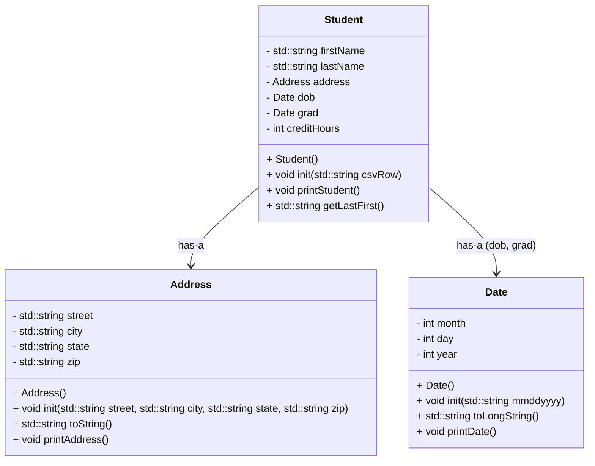

# CS121 Project 6

## Goal
* Normalize data with three classes (date, address, student). This week is implementing data and address.

## Input
* data::init*"mm/dd/yyyy") splits on "/" and stores integer fields. toLongString() uses a month-name table to print an output like "January 27, 1997".
* student::init(csvRow) splits the line by commas into 9 different types of data in this order: first, last, street, city, state, zip, dob, grad, credits.

## Printing
* address::printAddress() prints two lines
  * street
  * city state, zip
* date::printDate() prints 
  * month day, year
* student::printStudent() prints
  * first last
  * address (two lines)
  * DOB: dob
  * Grad: grad
  * Credits: credits
  * line of underscores
  * last, first
